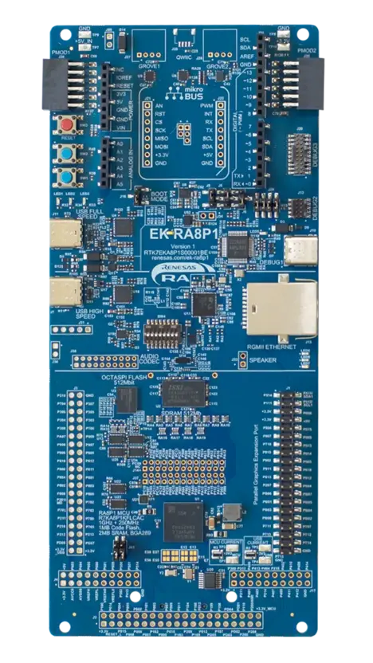
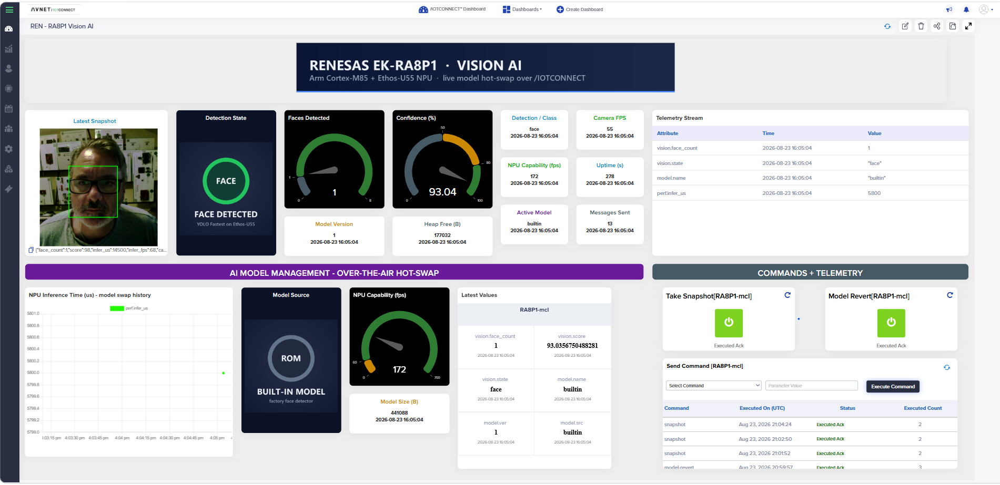

# Quickstart: Renesas EK-RA8P1 Vision AI with /IOTCONNECT

Purchase the kit: [EK-RA8P1 Evaluation Kit for RA8P1 MCU Group](https://www.renesas.com/en/design-resources/boards-kits/ek-ra8p1)



## Contents

- [1. Introduction](#1-introduction)
- [2. Prerequisites](#2-prerequisites)
- [3. Hardware Setup](#3-hardware-setup)
- [4. Flash the Firmware](#4-flash-the-firmware)
- [5. Create /IOTCONNECT Account](#5-create-iotconnect-account)
- [6. Acquire Account Information](#6-acquire-account-information)
- [7. Device Template Setup](#7-device-template-setup)
- [8. Create a Device](#8-create-a-device)
- [9. Configure the Board](#9-configure-the-board)
- [10. Verify Data](#10-verify-data)
- [11. Import a Dashboard](#11-import-a-dashboard)
- [12. Deploy an AI Model](#12-deploy-an-ai-model)
- [13. Using the Demo](#13-using-the-demo)
- [14. Going Further: Custom Development](#14-going-further-custom-development)
- [15. Resources](#15-resources)

## 1. Introduction

This guide takes the [Renesas EK-RA8P1](https://www.renesas.com/en/design-resources/boards-kits/ek-ra8p1)
from unboxing to a connected device with a live /IOTCONNECT dashboard, using a prebuilt
binary. No toolchain and no source build required.

The board runs camera vision inference on its Ethos-U55 NPU and connects to /IOTCONNECT over
Gigabit Ethernet. Once connected you will deploy an AI model from the cloud, capture an
annotated snapshot, and open a live WebRTC video stream all on a microcontroller.

Models are deployed live from /IOTCONNECT AI Model Management: the device downloads a model,
validates it, and swaps it in between two inferences with no reflash and no reboot, then keeps
it in flash so it survives power cycles. The same board becomes a face detector, an occupancy
sensor, or a 1000-class image classifier depending on which model you push.

To build the same application from source, see the [Developer Guide](developer.md).

> [!NOTE]
> This guide has been written and tested with the hardware and software listed below, but may
> work with other environments with some modifications.

## 2. Prerequisites

### Hardware

* [EK-RA8P1 Evaluation Kit](https://www.renesas.com/en/design-resources/boards-kits/ek-ra8p1),
  which includes the board, the OV5640 camera expansion board, the 7-inch LCD, and the cables
* A USB-C cable to the board's DEBUG1 port (included in the kit)
* An Ethernet cable to a network with DHCP and internet access (included in the kit)
* PC with Windows 10/11 or Linux (tested on Ubuntu 24.04)

> [!NOTE]
> The 7-inch LCD is optional. With it attached you get live video and detection overlays on
> the board. Without it the device runs headless and the /IOTCONNECT dashboard becomes the
> interface.

### Software

* [SEGGER J-Link Software](https://www.segger.com/downloads/jlink/) — V9.38 required

> [!NOTE]
> Both newer and older versions have been tested and failed to flash the EK-RA8P1. 9.38 is the recommended version for use as it has been tested and succeeded.

* A serial terminal application:
  * Recommended, with nothing to install:
    [Chrome Labs Serial Terminal](https://googlechromelabs.github.io/serial-terminal/), which
    runs in Chrome or Edge (Web Serial is not available in Firefox or Safari). Tick Convert EOL
  * Windows: install either [PuTTY](https://putty.software) (the `.msi` installer) or
    [Tera Term](https://github.com/TeraTermProject/teraterm/releases) (the `.exe` installer)
  * macOS and Linux: use `screen` in a terminal, for example
    `screen /dev/tty.usbmodem* 230400` on macOS or `screen /dev/ttyACM0 230400` on Linux
    (if it is missing on Linux, `sudo apt install screen`)
* The prebuilt demo image:
  [`iotc-vision-ai-ek-ra8p1-demo.hex`](firmware/iotc-vision-ai-ek-ra8p1-demo.hex?raw=1)
  (must Right-Click the link, Save As). You will also need the device template and
  dashboard JSON from this repository, linked in the steps below

## 3. Hardware Setup

1. Seat the OV5640 camera expansion board on connector J35 and close the latch of the connector to secure the flex cable. 
2. If you are using the LCD, plug the Parallel Graphics Expansion Board onto connector J1 with
   pin 1 aligned to pin 1 on the EK-RA8P1. Then check the wide ribbon cable from the glass panel
   into the expansion board: open the connector latch, push the cable fully and squarely in, and
   close the latch. The cable can work loose in shipping, which leaves the screen white.
3. Connect the Ethernet cable from the board to your network.
4. Connect the USB-C cable from your PC to the board's DEBUG1 port. This single port provides power and communications.

The board powers up from the USB-C connection and appears on your PC as a serial port:
`JLink CDC UART Port (COMx)` on Windows (or `USB Serial Device (COMx)` if the J-Link software is
not installed yet), `/dev/tty.usbmodem…` on macOS, and usually `/dev/ttyACM0` on Linux. On
Linux, if the terminal reports permission denied or lists no port, run
`sudo usermod -aG dialout $USER` and log out and back in.

Serial terminal settings:

* Port: the board's serial port (above)
* Speed: `230400`
* Data: `8 bits`
* Parity: `none`
* Stop Bits: `1`
* Flow Control: `none`

Connect with the terminal you chose in [Prerequisites](#2-prerequisites):

* Chrome Labs Serial Terminal (recommended): open
  [googlechromelabs.github.io/serial-terminal](https://googlechromelabs.github.io/serial-terminal/)
  in Chrome or Edge. Set Baud rate to `230400` (data bits, parity and stop bits already default
  to 8, None and 1), tick Convert EOL, and leave Hardware flow control and Local echo unticked.
  Click Connect, select the board's port in the pop-up, and click Connect again.
* PuTTY: select Connection type `Serial`, enter the COM port under Serial line and `230400`
  under Speed. The data bits, parity, stop bits and flow control are under Connection → Serial.
* Tera Term: choose File → New connection, select Serial and the board's COM port, then set
  Speed to `230400` under Setup → Serial port.
* screen (macOS and Linux): run `screen /dev/tty.usbmodem* 230400` on macOS or
  `screen /dev/ttyACM0 230400` on Linux. To quit, press Ctrl+A, then K, then Y.

> [!IMPORTANT]
> The console runs at `230400` baud, not the more common `115200`. Set your terminal to send CR or CR+LF line endings, or the board will not accept typed commands.

## 4. Flash the Firmware

We will program the prebuilt demo image into the board's MRAM with the J-Link software. Two
options are given below, one using the J-Flash Lite window and one using the J-Link Commander
command line. Both produce the same result, so use whichever you prefer.

Download the demo image
[`iotc-vision-ai-ek-ra8p1-demo.hex`](firmware/iotc-vision-ai-ek-ra8p1-demo.hex?raw=1)
(must Right-Click the link, Save As).

> [!CAUTION]
> Whichever option you use, select the device `R7KA8P1KF_CPU0`. `CPU0` is the Cortex-M85 that
> runs this application — programming `_CPU1` will not produce a working device.

### Option A: J-Flash Lite (GUI)

1. Start J-Flash Lite.
2. Set Device to `R7KA8P1KF_CPU0`, Interface to `SWD`, and Speed to `4000 kHz`.
3. Click the `...` button next to Data File and select the demo image you downloaded.
4. Click the Program Device button. Programming takes about 15 seconds.
5. Unplug the USB-C cable, wait a second, and then plug it back in.

> [!NOTE]
> On Linux, J-Flash Lite may end with `ERROR: Could not download file.` even though the
> image was programmed correctly. Continue to the next step and if the board boots and prints
> to the serial console then you know the flash succeeded.

### Option B: J-Link Commander (command line)

1. Create a file named `flash.jlink` in the folder where you saved the demo image, containing:

   ```
   r                                         // reset the MCU
   h                                         // halt the core
   loadfile iotc-vision-ai-ek-ra8p1-demo.hex // program MRAM (~10 s)
   r                                         // reset so the new image boots cleanly
   g                                         // go (release the core)
   q                                         // quit, leaving the target running
   ```

2. Open a terminal in that folder and run the command for your platform:

   Windows:

   ```
   JLink.exe -device R7KA8P1KF_CPU0 -if SWD -speed 4000 -AutoConnect 1 -CommandFile flash.jlink
   ```

   Linux:

   ```
   JLinkExe -device R7KA8P1KF_CPU0 -if SWD -speed 4000 -AutoConnect 1 -CommandFile flash.jlink
   ```

3. Unplug the USB-C cable, wait a second, and then plug it back in.

### After flashing

> [!IMPORTANT]
> Power-cycle the board rather than pressing the RESET button, here and any time you restart the
> board. The LCD's timing controller only re-initialises from a cold start, so after a warm reset
> the panel stays white. Everything else keeps running, but the display will be blank until the
> next power cycle.

Verify the board is running. Open your serial terminal with the settings from
[Step 3](#3-hardware-setup). Within a few seconds you should see a processing report, repeated every 5 seconds:

```
FD: no built-in model in this build and no stored model - push one from IOTCONNECT AI Models
Processing time:
  Camera image capture vsync period :   18 ms,   55 fps
  AI inference pre processing time  :   15 ms,   66 fps
  AI inference time (Ethos-U55)     :    0 us,    0 fps
  LCD display vsync period          :   34 ms,   29 fps
IOTC: no credentials provisioned - use the serial CLI (type 'help') ...
```

The report pauses while you type and resumes about 20 seconds after your last keystroke, so
commands you enter in the following steps are not interrupted by it.

> [!NOTE]
> Power-cycling the board disconnects its serial port, so reconnect your terminal afterwards. In
> the Chrome Labs Serial Terminal, click Connect again, or tick Automatically connect to have it
> reconnect by itself.

Both messages are expected on a freshly flashed board. The camera is running at 55 fps.
Inference reads zero because this image carries no compiled-in model. Its flash budget went to
the live-video stack and you will deploy one from the cloud in
[Step 12](#12-deploy-an-ai-model). The cloud connection is configured in
[Step 9](#9-configure-the-board).

If the LCD is attached, it now shows the live camera image.

## 5. Create /IOTCONNECT Account

An /IOTCONNECT account with an AWS backend is required.  If you need to create an account, a free trial subscription is available.
The free subscription may be obtained directly from [iotconnect.io](https://iotconnect.io) or through the AWS Marketplace.

* Option #1 (Recommended)
/IOTCONNECT via [AWS Marketplace](https://github.com/avnet-iotconnect/avnet-iotconnect.github.io/blob/main/documentation/iotconnect/subscription/iotconnect_aws_marketplace.md) - 60 day trial; AWS account creation required

* Option #2
/IOTCONNECT via [iotconnect.io](https://subscription.iotconnect.io/subscribe?cloud=aws) - 30 day trial; no credit card required

> [!NOTE]
> Be sure to check any SPAM folder for the temporary password after registering.

Login to the platform by navigating to [console.iotconnect.io](https://console.iotconnect.io)

## 6. Acquire Account Information

The Company ID (CPID) and Environment (ENV) variables identifying your /IOTCONNECT
account must be configured for the device. Take note of these values for later reference
located in the "Settings" -> "Key Vault" section of the platform.


## 7. Device Template Setup

A device template defines the telemetry attributes and commands this demo uses.

* Download the premade device template
  [`ra8p1-vision-ai-template.json`](templates/ra8p1-vision-ai-template.json?raw=1)
  (must Right-Click the link, Save As, and save as a `.json` file type)
* Import the template into your /IOTCONNECT instance following the
  [Importing a Device Template](https://github.com/avnet-iotconnect/avnet-iotconnect.github.io/blob/main/documentation/iotconnect/import_device_template.md)
  guide

The imported template is named RA8P1 Vision AI with the template code `ra8p1vis`.

> [!IMPORTANT]
> Import the supplied template rather than creating one by hand. The numeric attributes must be
> of type DECIMAL; a hand-built template is the most common cause of a dashboard showing `null`
> for every value.

## 8. Create a Device

* Create a new device following the
  [Create a New Device](https://github.com/avnet-iotconnect/avnet-iotconnect.github.io/blob/main/documentation/iotconnect/create_new_device.md)
  guide, with these values:
  * Unique ID: a name of your choosing, such as `ek-ra8p1-01` — you will type this into the
    board in the next step
  * Entity: your company's entity (for new accounts, there is only one option)
  * Template: `RA8P1 Vision AI (ra8p1vis)`
  * Device Certificate: `Auto-generated`
* Click `Save & View`
* Download the device's certificate package from the device page and unzip it. It contains
  the device certificate and private key PEM files.

> [!CAUTION]
> The template enables video streaming (WebRTC), so the platform provisions a Kinesis Video
> Streams signaling channel at the moment the device is created. This cannot be added to an
> existing device later. A device created from a different template cannot stream video.

## 9. Configure the Board

We will store the cloud identity on the board over the serial console. The values are written to
the board's OSPI flash and survive power cycles, so this is a one-time step per board.

1. In the serial terminal, press Enter, then type `help` to list the provisioning commands.
2. Enter your account values, pressing Enter after each line and substituting your own:

   ```
   set env <your environment>
   ```
   ```
   set duid <your device ID>
   ```
   ```
   set cpid <your CPID>
   ```

   `env` and `cpid` come from the Key Vault in [Step 6](#6-acquire-account-information); `duid`
   is the Unique ID from [Step 8](#8-create-a-device).

3. Unzip the downloaded certificate zip folder and then open the included `.crt` file in 
a text editor.
4. Type `set cert`, then paste the entire device certificate PEM, including the
   `-----BEGIN CERTIFICATE-----` and `-----END CERTIFICATE-----` lines. Capture ends
   automatically at the END line and the board replies `certificate stored`. Nothing is echoed
   while you paste. To abort, press Enter on an empty line or type `cancel`.
5. Similarly, open the included `.pem` file in a text editor.
6. Type `set key`, then paste the private key PEM the same way.
7. Type `show` to review what is stored (the key is redacted), then type `apply` to
   connect.

> [!TIP]
> How to paste the PEM block depends on the terminal:
>
> * Chrome Labs Serial Terminal: Ctrl+V (Cmd+V on macOS).
> * PuTTY: Ctrl+V does not paste. Highlight the whole PEM block in your text editor, then paste
>   with a right-click (Windows) or a middle-click or Shift+Insert (Linux).
> * Tera Term: right-click or Alt+V, then click OK if it asks you to confirm a multi-line paste.
> * screen: use your terminal application's normal paste (Cmd+V on macOS, Ctrl+Shift+V in most
>   Linux terminals).

## 10. Verify Data

Within about 30 seconds of `apply`, the serial console shows:

```
IOTC: starting (env=poc duid=ek-ra8p1-01, credentials: stored)
IOTC: connected
FU: selftest creds fetch -> 0 (OK)
```

Switch back to the /IOTCONNECT browser window and verify the device status is displaying as
`Connected`. Open the device and select the Live Data tab to watch telemetry arriving every
10 seconds.

From now on the board connects automatically at every boot. There is no need to repeat
[Step 9](#9-configure-the-board).

## 11. Import a Dashboard

* Download the premade dashboard
  [`ra8p1-vision-ai-dashboard.json`](dashboard/ra8p1-vision-ai-dashboard.json?raw=1)
  (must Right-Click the link, Save As, and save as a `.json` file type)
* Select `Create Dashboard` from the top of the page
* Select the `Import Dashboard` option and select `RA8P1 Vision AI` for template and
  `ek-ra8p1-01` for device
* Enter a name (such as `RA8P1 Vision AI Demo Dashboard`) and complete the import

You will now be in the dashboard edit mode. You can add/remove widgets or just click `Save` in the upper-right corner to exit the edit mode.



The Detection State card switches artwork for face, clear, person and no person. When an
image classifier is running it shows CLASSIFYING, with the class label itself in the
Detection / Class tile. The Model Source card shows where the running model came from:
cloud (pushed and hot-swapped), flash (reloaded from the board's storage at boot), or builtin.

## 12. Deploy an AI Model

The firmware ships with no compiled-in model, so this step is required before the device will
detect anything. Deploying a model from the cloud is also the headline capability of this demo:
the device swaps models between two inferences, with no reflash and no reboot.

1. In the vertical toolbar on the left side of the UI in /IOTCONNECT navigate to AI Models 
(the icon with 3 blocks) and then select `Create Model`
2. Enter a name such as `RA8P1 Face Detect` and the code `ra8p1face`

> [!NOTE]
> Model codes must be 3–10 characters.

3. Set the version number of your choice
4. Set Model Type to `AI Model` and Variant to `Renesas`
5. Upload [`tools/models/face-v3_v3.zip`](tools/models/face-v3_v3.zip) from this repository
6. Leave "Convert through sagemaker?" unchecked

To deploy the model to your device, go back to the AI Models icon on the vertical toolbar and 
click on "Push Model." 

1. For "Model" choose `RA8P1 Face Detect`
2. The "Version" number should auto-fill
3. For "Device Template" choose `RA8P1 Vision AI`
4. Change the radio button to "Selected devices"
5. Click "Select Device" and then choose your device's Unique ID and click "Save"
6. Click "Push Model"

Watch the serial console. The download, validation, and hot-swap take a few seconds:

```
IOTC: model downloaded (441248 bytes)
FD: hot-swapping to model "face-v3" v3 (441088 bytes)
FD: model "face-v3" v3 (cloud, 441088 bytes) loaded: face detector, ethos-u: yes
FD: model persisted to OSPI flash store
FD: 1 face(s): [25,63 49x58 90%]
```

Step in front of the camera. The dashboard's Detection State card switches to FACE DETECTED and
the Faces gauge moves; on the LCD, green boxes track the face.

Four more models are bundled in
[`tools/models/`](tools/models/). Register and deploy them exactly as above to change what
the device does, without a reflash and without a reboot:

| Zip | Suggested name | Code | What the device becomes | Inference time |
|---|---|---|---|---|
| `face-v3_v3.zip` | RA8P1 Face Detect | `ra8p1face` | Face detector with boxes | ~5.8 ms |
| `person-detect_v2.zip` | RA8P1 Person Detect | `ra8p1prsn` | Occupancy sensor — walk in and out of frame | ~1.5 ms |
| `mobilenet-025_v1.zip` | RA8P1 ImageNet Classifier 0.25 | `ra8p1mn025` | 1000-class classifier, speed tier | ~4.5 ms |
| `mobilenet-050_v1.zip` | RA8P1 ImageNet Classifier 0.5 | `ra8p1mn050` | 1000-class classifier, mid tier | ~9 ms |
| `mobilenet-v2_v1.zip` | RA8P1 ImageNet Classifier v2 | `ra8p1mnv2` | 1000-class classifier, accuracy tier — hold up a coffee mug, a banana, a water bottle | ~40 ms |

The `mobilenet-v2` model is roughly 7x larger than the face detector, and the device 
absorbs it mid-flight. Watch the Uptime tile on the dashboard while the swap happens. 
It keeps counting, which is the proof that nothing rebooted.

> [!NOTE]
> `model-revert` clears the stored model rather than falling back to a built-in one. This
> image has no compiled-in model, so after a revert inference idles until you push another
> model.

The model also survives power loss. Unplug the USB-C cable, wait a few seconds, and plug it
back in: the board boots straight into the last model you pushed, reconnects, and resumes
telemetry. The LCD and the dashboard's Model Source card now read `flash` instead of `cloud`,
showing the model was reloaded from the board's non-volatile OSPI flash rather than pushed again.


## 13. Using the Demo

The dashboard has two command buttons: Take Snapshot and Model Revert. Send every other
command from the Command tab on the device's page in /IOTCONNECT.

Capture a snapshot. Click Take Snapshot on the dashboard, or send the `snapshot` command. Within
about a minute the dashboard's Latest Snapshot widget shows a color photograph of what the
camera saw, with the detection boxes drawn onto it and tagged with the detection results and
performance figures at the moment of capture. The board annotated the image, PNG-encoded it, and
uploaded it to S3 with an AWS SigV4 signature computed on the microcontroller. There is no
gateway or intermediary in the path. On a headless installation this is the viewfinder.

| Command | Effect |
|---|---|
| `snapshot` | Captures what the camera sees, draws the detection boxes on it, and uploads an annotated color PNG to Telemetry Files (about a minute) |
| `set-interval <seconds>` | Telemetry period; the default is 10 seconds |
| `model-info` | Acknowledges with the active model's name, version, source, and size |
| `model-revert` | Clears the stored model; inference idles until the next model is pushed |
| `set-brightness <0\|1>` | Camera exposure target: `0` is normal, `1` brightens the image by roughly 1 EV for dim rooms |
| `led-auto` | Toggles the detection LED. While enabled, the board's green user LED (P303) lights whenever a face or a person is in frame, and goes dark when the frame clears. Off by default. Pass `0` or `1` to set it explicitly instead of toggling |
| `reboot` | Restarts the device. It reconnects and reloads its stored model in about 30 seconds |

> [!IMPORTANT]
> `reboot` is a warm reset, so the LCD stays white afterwards until the board is power-cycled.
> Everything else (telemetry, video, model storage) comes back normally. Prefer a power
> cycle when the display is part of what you are showing.

Live video. The dashboard's Live Video Stream (KVS) widget shows the camera feed. For a larger
view of the same stream, open the device, select the Video Streaming tab, and click Start in the
top-right corner (it then changes to Stop, which ends the stream). Within a few seconds the
browser negotiates a WebRTC session with the board and the camera's live view appears. It is 
H.264-encoded in software on the Cortex-M85 at 320x240, roughly 8–10 frames per second. Inference and
telemetry keep running while the stream is live, and you can deploy a model from [Step
12](#12-deploy-an-ai-model) without stopping the video. The device downloads and hot-swaps it
with the stream still playing.

> [!NOTE]
> The firmware supports one viewer at a time, so close the dashboard tab before you click Start
> on the Video Streaming tab, and stop the stream before you go back to the dashboard. If the
> first session after a boot stays black, click Stop and Start once more and allow about 15
> seconds for the connection to be established.

The same commands are also available on the serial console, along with `show`, `erase`,
`reboot`, and `quiet`. Type `help` to list them.

> [!NOTE]
> The console prints a periodic status report. It pauses on its own as soon as you start
> typing and resumes about 20 seconds after your last keystroke, so you do not have to fight
> it while entering commands or pasting a certificate. `quiet` silences it altogether, and
> `quiet 0` brings it back.

Clearing a board. The cloud identity is stored on the board, so a board that is passed on
to someone else keeps working as your device. To remove it, type `erase` followed by `reboot`
in the serial console. The board returns to the unprovisioned state from
[Step 4](#4-flash-the-firmware), ready to be configured for a different account.

## 14. Going Further: Custom Development

Building from source, the firmware architecture, the telemetry and command reference, adding
your own Vela-compiled models, and the live-video internals are all covered in the
[Developer Guide](developer.md). If something is not working, see its
[Troubleshooting](developer.md#15-troubleshooting) section.

## 15. Resources

* [Developer Guide](developer.md) — build from source, the architecture, and adding your
  own Vela-compiled models
* [Workshop slides (PDF)](docs/EK-RA8P1-vision-ai-workshop.pdf) — the hands-on workshop built on
  this demo: connecting the board, deploying models, and validating the hot-swap
  ([PowerPoint](docs/EK-RA8P1-vision-ai-workshop.pptx))
* [Purchase the EK-RA8P1 Evaluation Kit](https://www.renesas.com/en/design-resources/boards-kits/ek-ra8p1)
* [/IOTCONNECT Overview](https://www.iotconnect.io/)
* [/IOTCONNECT Knowledgebase](https://help.iotconnect.io/)

## Revision Info


- View changes to this repository: [Commit History](https://github.com/avnet-iotconnect/iotc-freertos-ek-ra8p1/commits/main)
- View changes to this document: [README.md](https://github.com/avnet-iotconnect/iotc-freertos-ek-ra8p1/commits/main/README.md)
