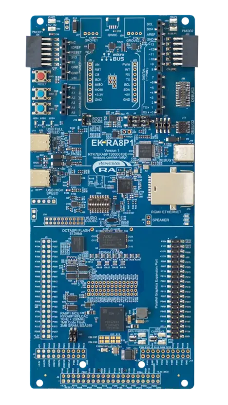

# Quickstart — flash a prebuilt image

Run the vision pipeline (camera → Ethos-U55 NPU inference) on your EK-RA8P1 in about five
minutes, using the prebuilt image in [firmware/](../firmware/) — no toolchain required.

> The prebuilt image runs the **local** demo only: live face detection with serial output
> and, if the LCD is attached, on-screen overlays. It contains no cloud credentials, so
> /IOTCONNECT connectivity stays off. To connect your own device to the cloud (telemetry,
> snapshots, model push) build once from source with your device's certificate — see the
> [Developer Guide](DEVELOPER-GUIDE.md).

## Contents

- [1. What you need](#1-what-you-need)
- [2. Flash](#2-flash)
- [3. What you should see](#3-what-you-should-see)
- [4. Next steps](#4-next-steps)
- [Troubleshooting](#troubleshooting)

## 1. What you need



*The EK-RA8P1 board (image: Zephyr Project documentation).*

- EK-RA8P1 kit with the OV5640 camera board fitted (J35 / MIPI connector)
- USB-C cable to the **DEBUG1** port (this is the on-board J-Link and the serial console)
- [SEGGER J-Link Software](https://www.segger.com/downloads/jlink/) **V9.38 or later**
  (earlier versions do not support the RA8P1)
- The bundled 7" LCD, **optional**: with it attached you see live video and overlays on the
  panel; without it, results are available on the serial console — and once
  cloud-connected, the intended headless workflow is to view detections as telemetry and
  capture images on demand through the /IOTCONNECT dashboard

## 2. Flash

### Option A — J-Flash Lite (GUI, easiest)

1. Start **J-Flash Lite** (installed with the J-Link software).
2. Device: **R7KA8P1KF_CPU0** · Interface: **SWD** · Speed: 4000 kHz.
3. Data File: `firmware/iotc-vision-ai-ek-ra8p1-local-demo.hex`
4. **Program Device**. When it finishes, press the board's RESET button.

### Option B — J-Link Commander (CLI)

Create `flash.jlink` with the following J-Link Commander script (one command per line):

```
r                                                       // reset the MCU
h                                                       // halt the core
loadfile firmware/iotc-vision-ai-ek-ra8p1-local-demo.hex  // program MRAM (~10 s)
r                                                       // reset again so the new image boots cleanly
g                                                       // go (release the core)
q                                                       // quit, leaving the target running
```

then:

```
JLink.exe -device R7KA8P1KF_CPU0 -if SWD -speed 4000 -AutoConnect 1 -CommandFile flash.jlink
```

## 3. What you should see

- **LCD (if attached)**: live camera video with an information panel. Point the camera at a
  face — green boxes track it, and the panel shows the model name, face count, best score,
  NPU inference time in microseconds, and the camera frame rate.
- **Serial console** (the J-Link OB enumerates a COM port; **230400 baud**, 8N1):

  ```
  FD: model "builtin" v1 (builtin, 441088 bytes) loaded: face detector, ethos-u: yes
  FD: 1 face(s): [25,63 49x58 90%]
  Processing time:
    Camera image capture vsync period :   18 ms,   55 fps
    AI inference time (Ethos-U55)     : 5800 us,  172 fps
  ```

Reference figures: the camera delivers 55 fps and the NPU completes a full YOLO-Fastest
face detection in approximately 5.8 ms, leaving substantial compute headroom for larger
models.

## 4. Next steps

- **Connect it to /IOTCONNECT** — telemetry, cloud snapshots, and over-the-air model
  hot-swap: follow the [Developer Guide](DEVELOPER-GUIDE.md). You will import the device
  template, create a device with an X.509 certificate, drop the credentials into one
  gitignored header, and rebuild.
- **Run the full demo** — once cloud-connected, the [Demo Guide](DEMO-GUIDE.md) is the
  presenter's script, including pushing all five bundled models live.

## Troubleshooting

| Symptom | Fix |
|---|---|
| J-Link cannot find the device | Update J-Link software to V9.38+; select `R7KA8P1KF_CPU0` (CPU0 = the Cortex-M85), not `_CPU1` |
| Blank LCD | Check both LCD flat cables; the panel backlight only turns on once the app boots |
| No serial output | Pick the J-Link CDC UART COM port; the baud rate is **230400**, not 115200 |
| No camera image | Re-seat the OV5640 camera board on J35; the flex cable must be fully latched |
