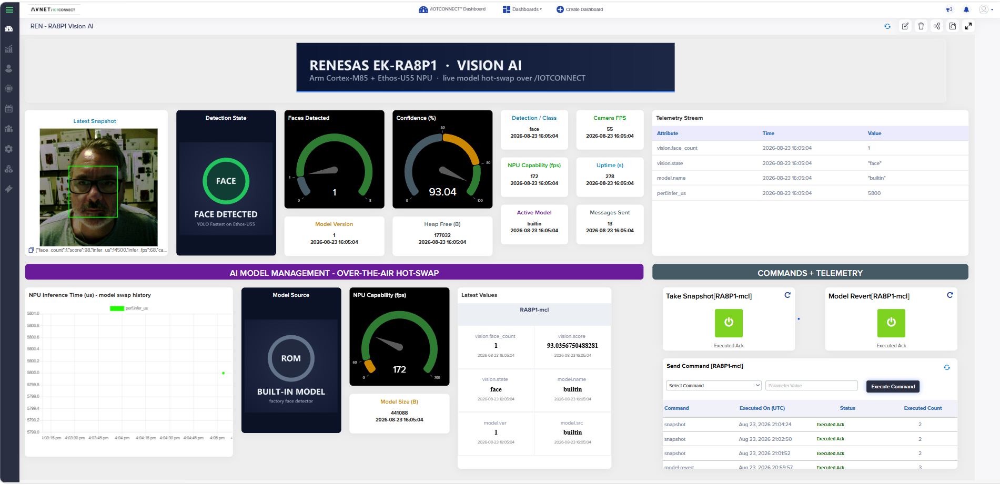

# Workshop: Vision AI with Cloud Model Management on the EK-RA8P1

**Audience:** embedded and IoT engineers; no prior Renesas or /IOTCONNECT experience needed.
**Duration:** about 75 minutes.

## What you will build

- A Renesas EK-RA8P1 running live face detection on its Ethos-U55 NPU, streaming results to
  /IOTCONNECT over Ethernet.
- A cloud dashboard showing detections, performance metrics, and device-captured snapshots.
- An over-the-air AI model deployment: you will push a different model from the cloud and
  watch the device change task in seconds, without a reflash or reboot.

## Prerequisites

Verify everything on this list before starting.

| Item | Requirement | Check |
|---|---|---|
| Board | EK-RA8P1 kit with the OV5640 camera board fitted on J35 | Camera flex cable latched |
| Network | Ethernet cable to a DHCP network with internet access | A laptop works on the same port |
| Cables | USB-C to the board's **DEBUG1** port | — |
| J-Link software | **V9.38 or later** ([download](https://www.segger.com/downloads/jlink/)) | `JLink.exe` starts and reports its version |
| Serial terminal | Tera Term, PuTTY, or similar | Can open a COM port at 230400 baud |
| Cloud account | /IOTCONNECT on the **AWS** backend | You can sign in |
| This repository | Cloned or downloaded | `firmware/iotc-vision-ai-ek-ra8p1-demo.hex` exists |
| LCD (optional) | Bundled 7" panel | Not required — the workshop works headless |

## Step 1 — Flash the prebuilt firmware (10 min)

In this step you will program the demo image into the board's flash.

1. Connect USB-C to **DEBUG1** and Ethernet to the board.
2. Start **J-Flash Lite** (installed with the J-Link software).
3. Set Device: **R7KA8P1KF_CPU0**, Interface: **SWD**, Speed: **4000 kHz**.
4. Select Data File: `firmware/iotc-vision-ai-ek-ra8p1-demo.hex`.
5. Click **Program Device**, wait for completion (about 15 seconds), then press the board's
   RESET button.

**Checkpoint:** J-Flash Lite reports the program operation completed without errors.

## Step 2 — Watch the vision pipeline run (5 min)

In this step you will confirm the NPU is running inference locally.

1. Open your serial terminal on the J-Link CDC COM port, **230400 baud**, 8N1.
2. Press the board's RESET button. Point the camera at your face.

**Checkpoint:** within a few seconds the console shows lines like:

```
FD: model "builtin" v1 (builtin, 441088 bytes) loaded: face detector, ethos-u: yes
FD: 1 face(s): [25,63 49x58 90%]
Processing time:
  Camera image capture vsync period :   18 ms,   55 fps
  AI inference time (Ethos-U55)     : 5800 us,  172 fps
IOTC: no credentials provisioned - use the serial CLI (type 'help') ...
```

The camera runs at 55 fps and a full face detection takes about 5.8 ms on the NPU. The last
line is expected — the cloud connection starts in Step 4. If the LCD is attached, it shows
live video with green detection boxes.

## Step 3 — Create the device in /IOTCONNECT (10 min)

In this step you will create the cloud identity the board will use.

1. Sign in to /IOTCONNECT. Go to **Device → Templates → Import** and import
   [`templates/ra8p1-vision-ai-template.json`](../templates/ra8p1-vision-ai-template.json)
   from this repository.
2. Go to **Device → Create Device**: choose that template, auth type **X.509** with an
   auto-generated certificate, and pick a Unique ID (for example `ek-ra8p1-01`).
3. Download the device's certificate package and unzip it — it contains the certificate and
   private key PEM files.
4. Note your **CPID** and **Environment** from **Settings → Key Vault**.

**Checkpoint:** the device appears in the device list (disconnected), and you have the two
PEM files, the CPID, the environment name, and your Unique ID at hand.

## Step 4 — Provision the board over the serial terminal (10 min)

In this step you will store the cloud identity on the board. It persists in the board's
OSPI flash across power cycles.

1. In the serial terminal, press Enter, then type `help` to see the provisioning CLI.
2. Enter your values (Enter after each line):

   ```
   set env <your environment>
   set cpid <your CPID>
   set duid <your Unique ID>
   ```

3. Type `set cert`, then paste the entire certificate PEM (including the BEGIN and END
   lines). Capture ends automatically; the board replies `certificate stored`.
4. Type `set key` and paste the private key PEM the same way.
5. Type `show` to review, then `apply` to connect.

**Checkpoint:** within about 30 seconds the console shows:

```
IOTC: starting (env=..., duid=..., credentials: stored)
IOTC: connected
FU: selftest creds fetch -> 0 (OK)
```

and the device shows **connected** in /IOTCONNECT with telemetry arriving every 10 seconds.

## Step 5 — Import the dashboard (10 min)

In this step you will bring up the prebuilt dashboard.

1. Upload the artwork from [`dashboard/images/`](../dashboard/images/) to the public image
   bucket under `images/renesas/ek-ra8p1/` (facilitators typically pre-stage this;
   filenames and case must match exactly).
2. Go to **Create Dashboard → Import Dashboard**, select the **RA8P1 Vision AI** template
   and your device, and choose
   [`dashboard/ra8p1-vision-ai-dashboard.json`](../dashboard/ra8p1-vision-ai-dashboard.json).

**Checkpoint:** the dashboard renders with live values, like this:



Step in front of the camera: the Detection State card switches to FACE DETECTED and the
Faces gauge moves.

## Step 6 — Capture a snapshot to the cloud (5 min)

In this step the board will photograph what it sees, annotate it, and upload it.

1. On the dashboard, press the **Take Snapshot** control (or send the `snapshot` command
   from the device page).

**Checkpoint:** within about 10 seconds the Latest Snapshot widget shows a color photo with
detection boxes drawn on it, tagged with the detection results. The image was PNG-encoded
and uploaded to S3 with a signature computed on the microcontroller.

## Step 7 — Push a different AI model from the cloud (15 min)

In this step you will re-task the device over the air. First register the models (one-time,
often pre-staged by the facilitator): **AI Models → Create Model**, Model Type "AI Model",
Variant "Renesas", and upload zips from [`tools/models/`](../tools/models/) — at minimum
`mobilenet-v2_v1.zip` and `person-detect_v1.zip` (codes must be 3–10 characters).

1. From AI Models, deploy **mobilenet-v2** to your device. Watch the serial console: the
   3 MB download, validation, and hot-swap take a few seconds.

   **Checkpoint:**

   ```
   IOTC: model downloaded (3152538 bytes)
   FD: hot-swapping to model "mobilenet-v2" v1 (3152368 bytes)
   FD: model "mobilenet-v2" v1 (cloud, 3152368 bytes) loaded: classifier, ethos-u: yes
   FD: model persisted to OSPI flash store
   ```

   The device is now a 1000-class image classifier. Hold a recognizable object in front of
   the camera — a coffee mug, a banana, a water bottle — and watch the Detection/Class tile
   and the CLASSIFYING card. Inference time on the dashboard chart jumps to about 40 ms:
   a roughly 7x larger workload, absorbed without a reboot (check the Uptime tile).

2. Deploy **person-detect**. Walk in and out of frame.

   **Checkpoint:** the state card flips between PERSON PRESENT and NO PERSON, and inference
   time drops to about 1.5 ms — the same device is now an occupancy sensor.

3. Press the **Model Revert** control to return to the built-in face detector.

   **Checkpoint:** detection boxes return; the Model Source card shows BUILT-IN MODEL.

## Step 8 — Prove persistence (5 min)

In this step you will show that both the credentials and the deployed model survive power
loss.

1. Deploy any model from Step 7 again, then remove the board's power. Repower it.

**Checkpoint:** without any reprovisioning, the console shows the pushed model loading from
flash and the cloud reconnecting:

```
FD: model "mobilenet-v2" v1 (flash, 3152368 bytes) loaded: classifier, ethos-u: yes
IOTC: starting (..., credentials: stored)
IOTC: connected
```

## Troubleshooting

| Symptom | Cause | Fix |
|---|---|---|
| J-Link cannot find the device | Old J-Link software, or wrong core selected | Update to V9.38+; use `R7KA8P1KF_CPU0`, not `_CPU1` |
| No serial output | Wrong COM port or baud rate | Use the J-Link CDC port at **230400**, not 115200 |
| Typed characters ignored in the CLI | Terminal not sending CR line endings | Set line ending to CR or CR+LF |
| Dashboard values show `null` | Template created by hand with wrong attribute types | Import the bundled template (numerics must be DECIMAL) |
| Dashboard state cards are blank | Artwork not uploaded, or wrong S3 key case | Re-check Step 5.1 filenames exactly |
| Snapshot ack says upload failed | Transient network error | Send the command again; confirm boot printed `FU: file upload ready` |
| Model push never arrives | Deployment not dispatched platform-side | Re-push; the device logs `MQTT: C2D message` the moment one arrives |
| Classifier labels look odd | Scene shots instead of a single object | Hold one object centered, close to the camera |

## Cleanup and next steps

- To remove the stored identity from a shared board: type `erase` then `reboot` in the CLI.
- To go deeper — build from source, add your own Vela-compiled models, or study the
  architecture — continue with the [Developer Guide](DEVELOPER-GUIDE.md).
- For a condensed presenter version of this flow, see the [Demo Guide](DEMO-GUIDE.md).
